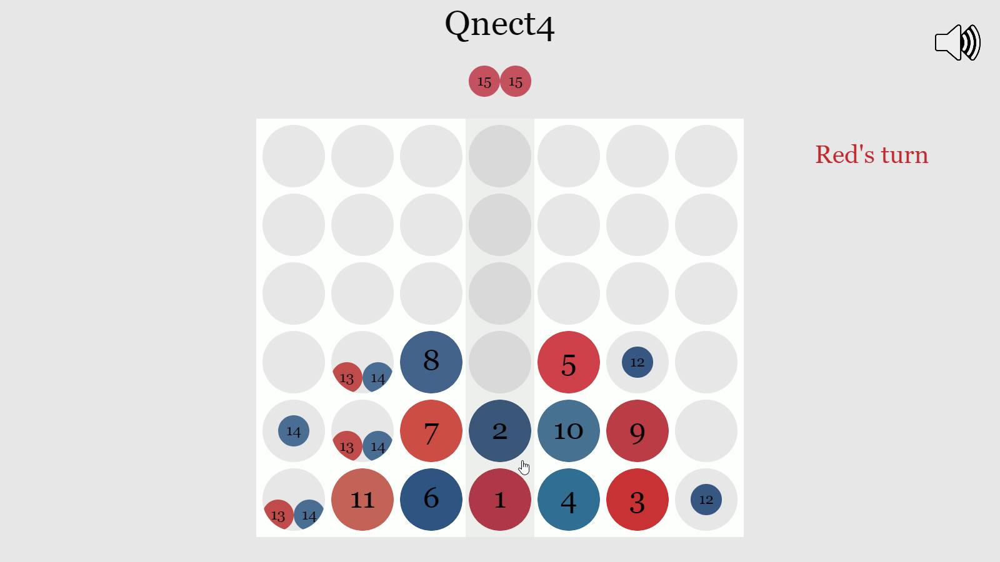

# Qnect4

A quantum gravity board game

## Running

The lastest version will be hosted on Github [here](https://parameterized.github.io/qnect4).

If you want to modify the code, install the dependencies (`npm install`) then `npm run dev-server` to start the webpack development server.

## Gameplay

Qnect4 is based on [Quantum tic-tac-toe](https://en.wikipedia.org/wiki/Quantum_tic-tac-toe). It shares the main mechanic of being able to place a move in 2 locations at once, but gravity will often cause a move to interact with other move superpositions and be split into more than just 2 possible locations. The rules for measurement are also different.

### Measurement

A player will be allowed to measure a cell (choose a disk to collapse its superposition to that cell) when the opposing player's turn leaves that cell either entangled with 4 disks, or in a state where it's no longer possible for it to be empty (as in the case of a bottom row cell if all superpositions of a disk exist in that column, or if a cell above contains a classical disk). Measurement of one cell may change the eligibility of other cells for measurement at that time.

Placing both of your moves in the same column will immediately collapse to a classical disk (with definite location) if no spooky disks (disks that exist in multiple locations) are in that column.

### Superposition and indirect collapse

If your move falls onto another spooky disk, it will be split into two - one where it is stopped by that disk and one where it isn't. If the obstructing disk is later measured to be in another location, the spooky disk created by your move which was obstructed will effectively be measured to not exist in that location, and if there is only one remaining possible location, it will collapse and become a classical disk in that location.

### Winning

Four in a row (horizontally, vertically, or diagonally) of classical disks will win the game. If a single move causes both players get four in a row (I'm not sure if this is possible), the game will be tied.

## Controls
- Left click a column to drop one of your spooky disks into it
- If a cell is potentially occupied by 4 different disks (and not supported by spooky disks), left click one of the disks to collapse it to that position